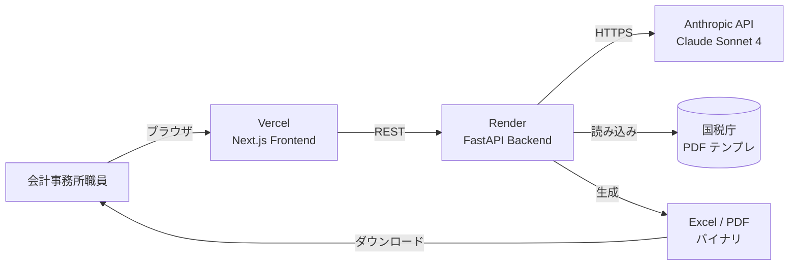

# 事前確定届出書 自動生成システム

> 会計事務所向け、議事録メモから国税庁様式 C1-23 を自動生成する Web アプリケーション  
> AIエンジニア案件デモ（会計業務自動化／システム連携）

## 概要

国税庁様式「事前確定届出給与に関する届出書」の作成を自動化するデモアプリケーションです。株主総会の議事録メモ（自然言語）と役員マスタ CSV を入力すると、Claude API が必要項目を構造化抽出し、Excel と PDF の両形式で帳票を生成します。

## デモ URL

🚧 デプロイ後追記

## 使い方

1. 役員マスタ CSV をアップロード
2. 株主総会決議メモをテキストで入力（サンプル読み込みボタンあり）
3. 「AI で抽出」をクリック
4. 抽出結果を確認・修正
5. Excel または PDF をダウンロード

## 開発開始方法

### 前提
- Node.js 20+
- Python 3.11+
- Anthropic API キー

### Phase 0：手動セットアップ

1. このリポジトリをクローン
2. `samples/` に国税庁の以下 PDF を配置：
   - 本表：`samples/honpyo_template.pdf`  
     https://www.nta.go.jp/law/tsutatsu/kobetsu/hojin/010705/pdf/068-1.pdf
   - 付表1：`samples/futahyo1_template.pdf`  
     https://www.nta.go.jp/law/tsutatsu/kobetsu/hojin/010705/pdf/069-1.pdf
3. `api/.env` を `api/.env.example` をコピーして作成、API キーを記入
4. `web/.env.local` を作成、`NEXT_PUBLIC_API_BASE_URL=http://localhost:8000` を記入

### Phase 1〜5：Claude Code で自動構築

プロジェクトルートで Claude Code を起動し、以下を実行：

```
INSTRUCTIONS.md を読み込んで、Phase 1 から順に実装してください。
各 Phase 完了時に動作確認結果を報告し、私の OK を待ってから次へ進んでください。
```

## ドキュメント

- `INSTRUCTIONS.md` - Claude Code 用の完全実装指示書
- `docs/architecture.md` - システム構成図とデータフロー
- `docs/demo_script.md` - 面談用の 5 分デモスクリプト
- `docs/future_roadmap.md` - 拡張ロードマップ
- `extraction_schema.json` - Claude API の構造化抽出スキーマ

## 技術スタック

| 領域 | 技術 |
|---|---|
| フロント | Next.js 14 / TypeScript / Tailwind CSS / shadcn/ui |
| バック | Python 3.11 / FastAPI / pandas / openpyxl / pypdf / reportlab |
| AI | Claude API (Sonnet 4) による構造化抽出 |
| インフラ | Vercel + Render |

## アーキテクチャ



## ローカル起動

### バックエンド（FastAPI）

```bash
cd api
python -m venv venv
source venv/Scripts/activate  # Windows
# source venv/bin/activate    # macOS/Linux
pip install -r requirements.txt
cp .env.example .env
# .env に ANTHROPIC_API_KEY を設定
uvicorn main:app --reload
```

### フロントエンド（Next.js）

```bash
cd web
npm install
# .env.local に NEXT_PUBLIC_API_BASE_URL=http://localhost:8000 を設定
npm run dev
```

`http://localhost:3000` でアクセス。

## 拡張プラン

- TKC API / 弥生 API 直接連携
- e-Tax XML 形式での書き出し
- 議事録 PDF/画像からの OCR 入力
- 複数法人対応（会計事務所が顧問先 100 社を管理できる UI）

## 作者

月村駿 / Shun Tsukimura
https://shuntsukimura-tech.vercel.app
