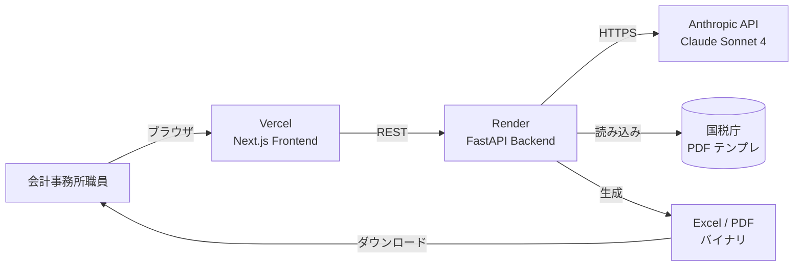
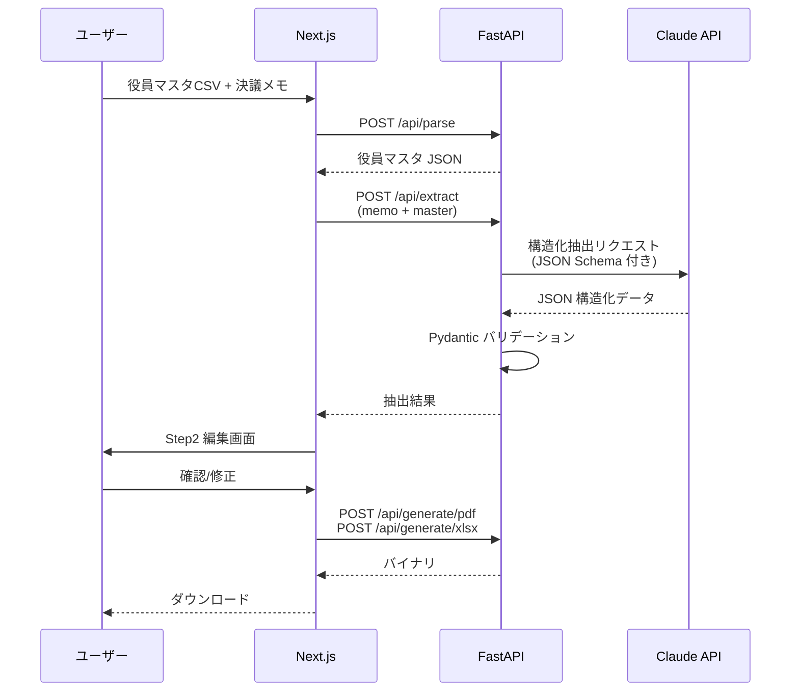

# アーキテクチャ

## システム全体構成

## データフロー

## 技術選定理由

### Next.js 14 (App Router)
- Vercel との親和性とゼロコンフィグデプロイ
- Server Components で初期表示が高速
- shadcn/ui との組み合わせで業務システム品質の UI を短期間で構築可能

### FastAPI
- Python 必須要件への直接対応（案件文の必須条件）
- Pydantic との統合で型安全な API
- OpenAPI 自動生成で会計事務所側のシステム連携時に有利

### Claude API（Sonnet 4）
- 日本語の長文・敬語混じり議事録の構造化に強い
- JSON Schema 準拠出力が安定
- コストパフォーマンス（GPT-4 と比較して同等以上の精度で安価）

### Render（Backend）
- Python アプリのデプロイが Docker without Dockerfile でも可能
- 無料枠でデモ用途は十分
- 本番想定時は Starter プラン（月7USD）でスリープ解消

### Vercel（Frontend）
- Next.js のネイティブホスティング
- プレビューデプロイで Pull Request ごとに URL が生成され、面談で見せやすい

## セキュリティ設計（デモ版）

- API キーはバックエンド側の環境変数のみ。フロントには露出させない
- CORS は環境変数で許可オリジンを限定
- アップロードファイルは処理後すぐにメモリから解放、ディスクに書かない
- Claude API の data retention 設定は zero retention を選択（本番想定）

## スケーラビリティ

| 項目 | デモ | 本番想定 |
|---|---|---|
| 同時ユーザー | 1 | 10〜50 |
| 月間届出書生成数 | 10 | 200〜500 |
| Claude API コスト | 月100円未満 | 月1万〜3万円 |
| インフラコスト | 0円 | 月3000〜8000円 |

## 拡張時の差分

### TKC 連携
TKC FX クラウドはエクスポート API があり、仕訳データを CSV/Excel で取得可能。`api/services/tkc_importer.py` を追加し、既存の CSV パーサーと同じ JSON 構造に変換するアダプタ層を入れる。

### 弥生会計連携
弥生会計オンラインの API は OAuth 認証必要。Next.js 側に OAuth フロー追加、バック側に `services/yayoi_importer.py` を追加。

### e-Tax XML 出力
e-Tax は独自 XML スキーマ。`services/etax_xml_builder.py` を追加して、構造化データから直接生成。`/api/generate/etax` エンドポイントを追加。
